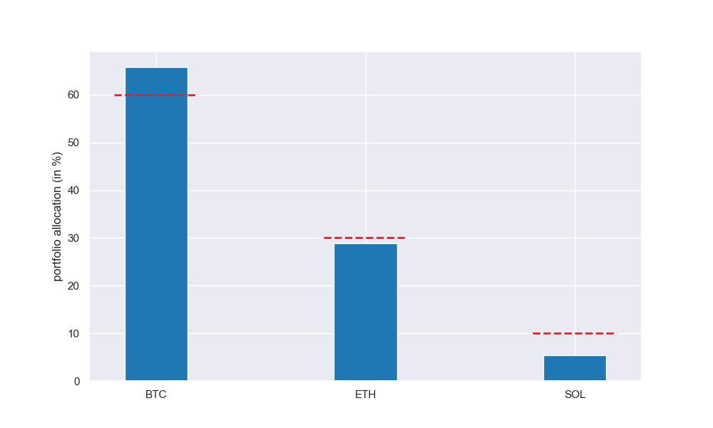
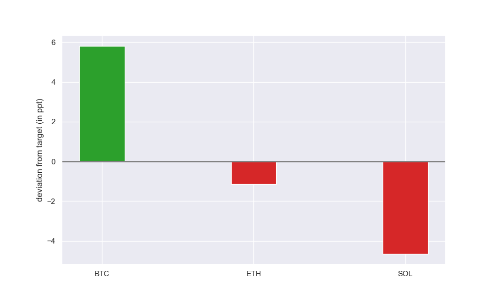
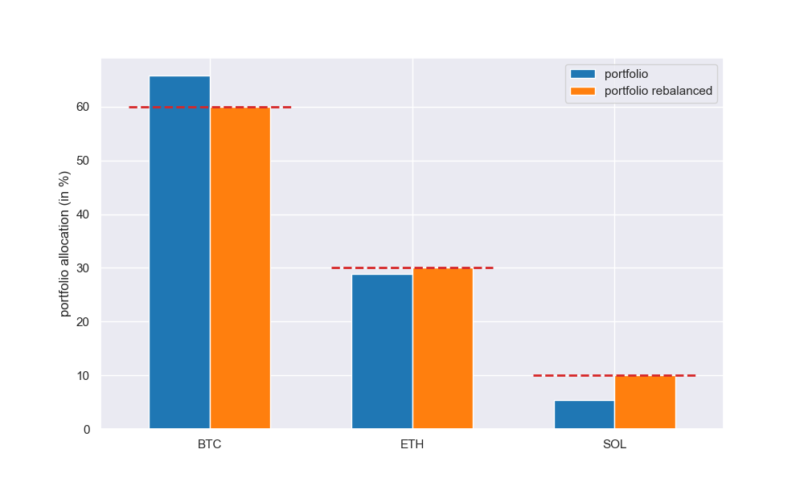
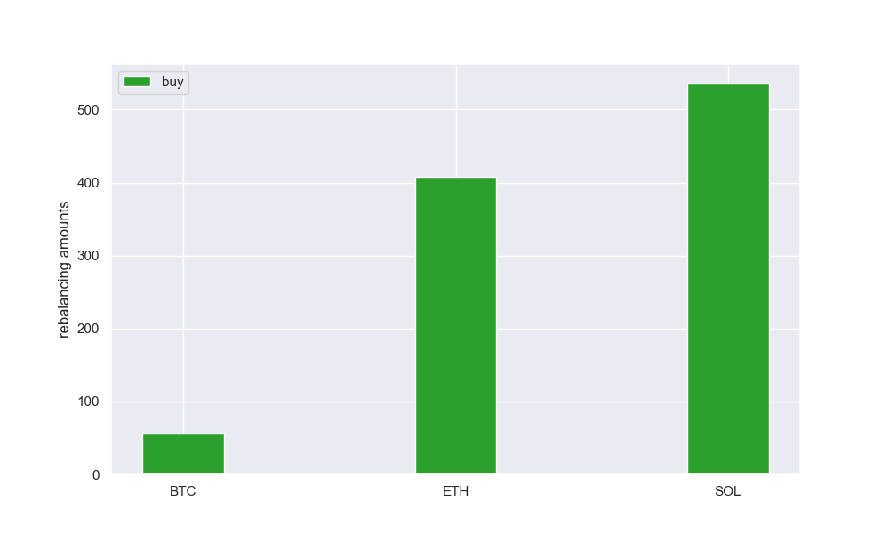

<h1 align="center">A Simple Portfolio Rebalancer</h1>

## Description

Financial assets produce different returns *over time* that can change the portfolio's target asset allocation. To
restore the portfolio's original risk profile, the portfolio should therefore be rebalanced. Standard portfolio
rebalancing involves mainly two strategies: (1) Rebalancing via buying and selling of assets to maintain a target asset
allocation, (2) Rebalancing via cash flows, i.e., buying underweight assets with new contributions or in case of 
drawing down the portfolio, selling overweight assets with withdrawals. 

This repository provides a simple portfolio rebalancing package that calculates rebalancing amounts for buy-and-sell
as well as cash flow rebalancing. In detail, the package offers the following features:

1. *Buy-and-sell:* The rebalancer calculates the assets to be bought and sold to restore the target asset allocation.
2. *Buy-only:* Given the total amount of funds to be invested, the rebalancer calculates the allocation of assets to be
   bought to bring the portfolio as close as possible to the target asset allocation.
3. *Sell-only:* Given the total amount of funds to be taken out, the rebalancer calculates the allocation of assets to
   be sold to bring the portfolio as close as possible to the target asset allocation.

## Getting Started

### Dependencies

* [SciPy](https://scipy.org/)
* [Pandas](https://pandas.pydata.org/)
* [Numpy](https://numpy.org/)
* [Matplotlib](https://matplotlib.org/)
* [Seaborn](https://seaborn.pydata.org/)

See ```requirements.txt``` for details on the version numbers.

### Installation

* Install package: ```pip install portfoliorebalancer```
* Clone package: ```git clone git@github.com:quantfaf/portfoliorebalancer.git```

### Usage

Please see the Jupyter Notebook ```rebalancer.ipynb``` for a full overview of functionalities of this package or
type ```help(Rebalancer)``` after the import.

#### Example: Rebalance with cash flows

The following example illustrates
*buy-only rebalancing* of a three-asset portfolio to bring the portfolio as close as possible to the desired target
asset allocation.

#### Define your portfolio and the funds to be invested

```
asset_names = ['BTC', 'ETH', 'SOL']
target_asset_allocation = [0.60, 0.30, 0.10]
asset_positions = [0.14, 0.9, 5.0]
asset_prices = [44000.0, 3000.0, 100.0]
funds = 1000.0
```

#### Create instance of Rebalancer class

```
r = Rebalancer(asset_names,
               asset_positions,
               asset_prices,
               target_asset_allocation,
               rebalancing_strategy='buy_only',
               funds=funds)
```

#### Plot current portfolio allocation

The plot shows the current market value for each asset relative to the total market value. The red dashes indicate the
target asset allocation. Thus, BTC has a higher weight whereas ETH and SOL have a lower weight compared to the target
asset allocation.

```
r.rebalance().plot(content='portfolio')
```



#### Plot the deviation from the target asset allocation

```
r.plot(content='deviation')
```



#### Plot rebalanced portfolio

We invest ```funds=1000.0```  to bring the portfolio as close as possible to the desired target asset allocation.

```
r.plot(content='rebalanced_portfolio')
```



#### Plot rebalancing amounts

The chart shows how the funds should be allocated to bring the portfolio as close as possible to the desired target
asset allocation.

```
r.plot(content='rebalancing_amounts', normalized=False)
```



## Roadmap

See [open issues](https://github.com/quantfaf/portfoliorebalancer/issues) for a list of proposed features and known
issues.

## Contributing

If you have a suggestion that would make the portfolio rebalancer better, please fork the repo and create a pull
request. You can also simply open an issue.

## License

Distributed under the MIT License. See ```LICENSE``` for more information.

## Contact

[quantfaf@gmail.com](mailto:quantfaf@gmail.com)
